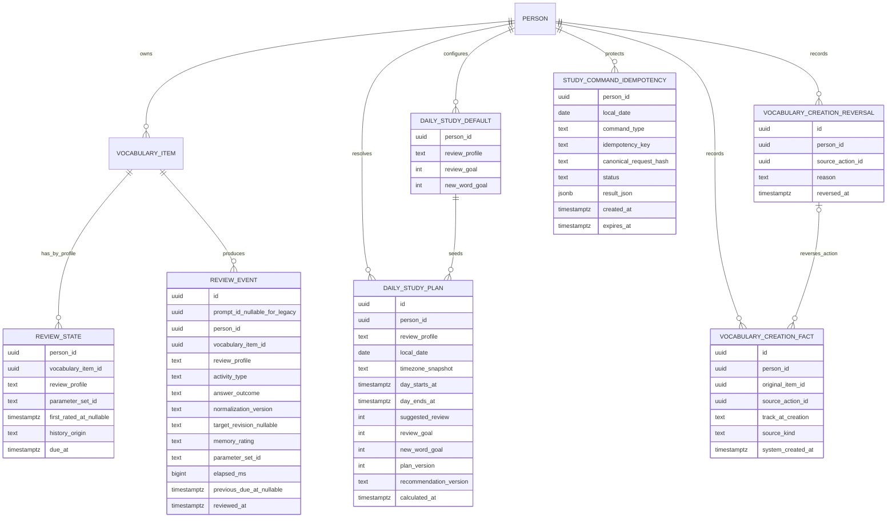
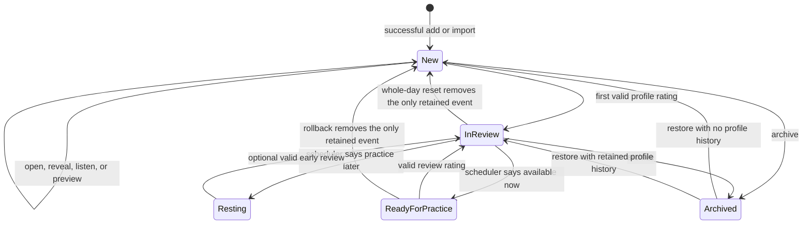
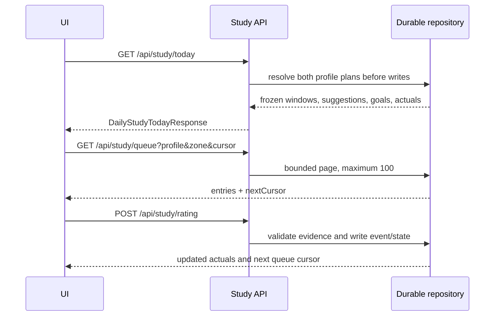
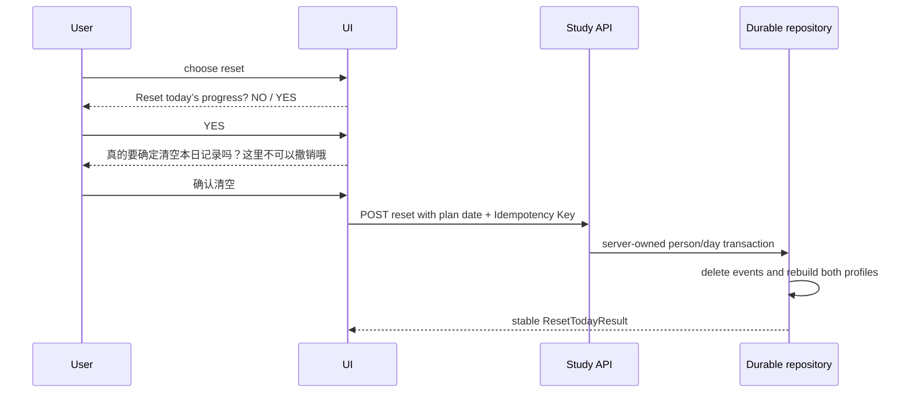

# Words Learning App For Mimi V2 Stage 1: Product, Metric, And Data Contract

Created: 2026-07-13 14:46 AEST
Last updated: 2026-07-13 15:42 AEST

Source plan:

- `plan_docs/PLAN_V2_MASTER.md`

Derived from:

- `plan_docs/PLAN_V2_MASTER.md`
- `plan_docs/PLAN_V1_STAGE7_9_DUAL_TRACK_DATA_IMPORT.md`
- `plan_docs/PLAN_V1_STAGE7_10_LIBRARY_REVIEW_CONTROLS.md`
- `plan_docs/PLAN_V1_STAGE7_11_REVIEW_ROLLBACK_AUTO_REFRESH.md`
- `plan_docs/PLAN_V1_STAGE8_REVIEW_MEMORY_ALGORITHM.md`
- `plan_docs/PLAN_V1_STAGE8_5_DATA_LIFECYCLE_ENVIRONMENT_STRATEGY.md`
- `ARCHITECTURE.md`

Input evidence:

- Mimi's request to separate New Words from Review and show the system's suggested review amount.
- The user's accepted four-value, per-Track daily model and later V2 corrections.
- The V1 local, Postgres, API, backup, queue, reset, and settings implementation inspected on 2026-07-13.

Consumer / next stage:

- V2-2 AI Quality And Security Gate.
- V2-3 Data Model And Backup Parity.
- V2-5 Daily Learning Engine.
- V2-6 Active Practice Engine.

Document nature:

This is a derived V2 Stage 1 plan and frozen executable contract. It is not an independent peer plan. It defines future data and behavior without activating those behaviors in the live V1 runtime.

Current operational tier: Tier 3.

Target capability tier: Tier 3.

Working tier: Tier 3.

Status: implemented locally on 2026-07-13 after the user approved V2 Stage 1. The document was written before the isolated contract code. Runtime integration remains assigned to later V2 stages.

## Scope

- Freeze daily values, actual values, query boundaries, date semantics, and edge cases.
- Freeze one-entry counting for a word, phrase, or fixed collocation.
- Freeze per-person and per-Review Profile（复习配置）goal behavior.
- Freeze separate Review and New Words queue behavior.
- Freeze the historical `Added today` result after archive, hard delete, and batch rollback.
- Freeze first-rating, same-day repeat, reset, and one-word rollback semantics.
- Freeze the minimum Active event evidence and typed-answer normalization.
- Produce State, Schema（数据库结构）, API（应用程序接口）, and compatibility diagrams.
- Add pure TypeScript（类型脚本）contract code and focused unit tests that are not connected to V1 runtime storage or UI.

## Non-Scope

- No change to the current V1 Dashboard, Settings, Review page, Practice Lab, navigation, or visible copy.
- No change to `VocabularyData`, Schema Version 5, `localStorage`, Postgres tables, existing SQL migrations, API routes, backup formats, CSV, or repository adapters.
- No Active scheduler, FSRS parameter set, SpeechSynthesis, Speech Recognition, microphone, or AI implementation.
- No package installation, external API call, paid provider, credential, `.env`, remote database, Production data, deployment, GitHub push, pull request, or merge.
- No SSO, per-person authorization, or confidential multi-user isolation.

## Safety / Side Effects

- This stage writes local documentation, pure contract modules, and unit tests only.
- Existing V1 executable behavior remains the runtime source of truth until later stages deliberately connect the new contract.
- Schema Version 5 remains unchanged. Any future persisted V2 shape starts with a new forward-only migration after `0002_schema5_production_runtime.sql`.
- Production time, timezone, identity, and system-created timestamps must eventually be server-owned. The pure contract accepts injected facts only to remain deterministic in tests.
- No lexical text from a hard-deleted item is required in the future addition ledger.

## Exit Criteria

- Every Stage 1 ambiguity listed by the V2 master plan has one accepted rule.
- The daily contract distinguishes system values, user goals, actual distinct entries, and attempt counts.
- Review and New Words cannot consume each other's goals.
- Goal validation accepts `0` and database-safe non-negative integers without rounding or silent clamping.
- `Added today`, `Suggested review`, `Learned today`, and `Reviewed today` have deterministic, testable definitions.
- Active answer comparison and evidence are versioned and do not require raw answer retention.
- Reset has the accepted two visible gates and one transactional, idempotent write.
- Schema and API diagrams identify later persistence work without changing Schema Version 5.
- Pure contract tests pass, followed by Tier 3 local validation and documentation synchronization.

## Current V1 Facts And Gaps

| Area | Current V1 fact | V2 Stage 1 contract |
| --- | --- | --- |
| Daily limit | One mixed limit per Track; values are rounded and clamped to `1..80` | Separate `reviewGoal` and `newWordGoal`; `0..2,147,483,647`; invalid values are rejected |
| Recognition queue | Ready and New entries share one in-memory queue and limit | Review and New Words use separate queries, goals, and remaining counts |
| Active queue | No scheduling behavior | Contract reserved; runtime remains unavailable until V2-6 |
| Dashboard actual | Counts raw Recognition events; Active inventory is shown as progress | Counts distinct entries and separates first learning from later review |
| Date | Dashboard uses browser machine date; scheduler uses person timezone | One person timezone source plus an immutable daily-plan window |
| `Added today` | No durable metric; deleted rows disappear | Creation ledger supplies a non-lexical historical fact |
| Learning stage | `VocabularyStatus` means active/archived lifecycle | `New` / `In review` is derived per Review Profile from state/history |
| Reset | One UI confirmation; Recognition events only | Two UI gates; one server command covering both profiles |
| Active evidence | No fields or events | Activity type, comparison outcome, normalization version, opaque target revision, elapsed time, rating |

The current `VocabularyStatus = new | archived` must not be reused as the learning stage. A non-archived item is `New` for a Review Profile only when that profile has no valid state or retained valid event.

## Identity And Counting Rules

### Canonical dimensions

- `ReviewProfile`: `recognition | active`.
- `StudyZone`: `review | new`.
- `LearningStage`: `new | in_review`, derived separately for each Review Profile.
- `ActivityType`: `recognition_card | say | spell | dictation`.
- Recognition and Active remain independent even though each Track currently maps one-to-one to its Review Profile.

### One entry means one

- Distinct learning/review values use the vocabulary-entry id. `Added today` uses the stable pair `(sourceActionId, originalVocabularyItemId)`.
- `adapt`, `take into account`, and `a blessing in disguise` each count as one entry.
- Whitespace token count, number of words in the phrase, meanings, examples, and number of attempts never multiply the entry count.
- Repeated attempts may be displayed separately, but they contribute at most one distinct entry to the relevant daily actual.

## Daily Plan And Time Boundary

Each person has one authoritative timezone source. Both Review Profiles use the same timezone for a plan day.

A daily plan stores:

- immutable `planId`, mutable integer `planVersion`, `personId`, and `reviewProfile`;
- `localDate` and the timezone snapshot;
- inclusive `dayStartsAt` and exclusive `dayEndsAt` UTC timestamps;
- `reviewGoal` and `newWordGoal` copied from defaults, then editable for that day;
- frozen `suggestedReview`;
- `recommendationVersion` and `calculatedAt`.

Rules:

1. The first daily read or rating write resolves both Track plans before a review event is written.
2. Production derives `now`, timezone, and day boundaries on the server. Client values are not trusted as authority.
3. A timezone change does not reinterpret an already-resolved `localDate`. It applies when the next daily plan is resolved.
4. `dayStartsAt <= eventTime < dayEndsAt` is the only membership test.
5. A direct Review-page visit cannot bypass Snapshot creation.
6. If a compatibility path creates a Snapshot after some reviews, an entry already reviewed today is included only when its earliest event that day has `previousDueAt < dayEndsAt`. The lower boundary is intentionally absent because accumulated ready entries also belong in the recommendation. Later same-day state changes cannot rewrite this test.
7. The two Track plan rows share the same person-day window but keep independent goals and suggestions.
8. The persisted unique key is `(personId, reviewProfile, localDate)`. Concurrent first resolution uses insert-on-conflict followed by a read, so two requests cannot create competing plans.
9. `recommendationVersion` identifies the suggestion method and is independent from `planVersion`. Updating today's goals checks `expectedPlanVersion`, increments `planVersion`, and leaves the frozen recommendation unchanged.

## Frozen Daily Values

| UI value | Owner | Frozen rule |
| --- | --- | --- |
| `Added today` | System | Creation facts inside the plan window, attributed to the Track at creation |
| `Suggested review` | System | Distinct available entries with prior profile evidence and a ready time before `dayEndsAt`; Snapshot value is not truncated by a goal |
| `Review goal` | User | Today's desired number of distinct previously learned entries |
| `New-word goal` | User | Today's desired number of distinct entries receiving their first valid rating |
| `Reviewed today` | Actual | Distinct entries with an event today and profile evidence from before `dayStartsAt` |
| `Learned today` | Actual | Distinct entries whose earliest retained valid profile event falls inside today's plan window |

`Learned today` and `Reviewed today` are mutually exclusive for the same entry on the same plan day. A word first learned today remains in `Learned today` even if it repeats later in the same learning process.

A legacy V1 state with no retained event is treated as prior `In review` evidence, with `historyOrigin = legacy_unknown` and `firstRatedAt = null`. V2-3 must not fabricate a first-rating timestamp from `updatedAt`, `lastReviewedAt`, or another later value. New V2 states always use `historyOrigin = recorded` and a non-null server timestamp. Reset and rebuild preserve the legacy marker until retained evidence supplies a real boundary. A later event for such an item contributes to `Reviewed today`.

### Actual formulas

```text
prior(item) = valid event before dayStartsAt
           OR profile state whose firstRatedAt is before dayStartsAt
           OR profile state marked legacy_unknown with firstRatedAt = null

learnedToday = distinct item ids with an event in the day AND NOT prior(item)
reviewedToday = distinct item ids with an event in the day AND prior(item)
attemptsToday = count of retained valid events in the day
```

`forgot` and `hard` are valid memory ratings and therefore may create the first profile event. Their same-session repeats do not add another distinct learned/reviewed entry.

Reset and `回退1词` recompute actuals from retained facts. Removing one of several same-day attempts does not reduce a distinct actual while another valid event for that entry remains.

Archive preserves review events and therefore preserves the actual values. Ordinary hard delete removes that item's state and events under the accepted V1 deletion semantics, so `Learned today`, `Reviewed today`, and `attemptsToday` may decrease. The non-lexical creation fact remains, so `Added today` does not decrease. A full `Batch imported` rollback removes the batch's vocabulary and review history and also reverses its creation action, so both its actual values and its historical `Added today` contribution disappear.

## `Added today` Ledger Decision

V2 uses two append-only fact types rather than the editable vocabulary timestamp.

Creation fact:

```text
creationFactId
personId
originalVocabularyItemId = stable non-lexical id retained after hard delete
sourceActionId = single-add command id, importBatchId, or accepted AI-add command id
trackAtCreation
sourceKind = single | batch | ai_add_to_learning
systemCreatedAt
```

Reversal fact:

```text
reversalFactId
personId
sourceActionId
reason = batch_rollback
reversedAt
```

Visible counting rules:

- Count only entries that completed a successful single-add or batch-import transaction.
- Choosing `Add to learning` after AI preview is also a successful creation and uses `sourceKind = ai_add_to_learning`; merely generating or previewing AI content does not count.
- Duplicate candidates, invalid rows, unchecked rows, rejected drafts, failed transactions, backup restore, and migration backfill do not become new activity for the current day.
- Archive, restore, edit, later Track change, and ordinary hard delete do not rewrite the historical creation fact.
- A later Track change leaves the count under `trackAtCreation`.
- A full `Batch imported` rollback appends one immutable reversal fact for its `sourceActionId`. It never edits the original creation facts. Every entry from that action is removed from visible historical `Added today` values, even if the rollback occurs on a later day; this is the intentional meaning of true undo.
- Re-importing after a rollback is a new successful creation and receives new creation facts.
- No removed word, meaning, example, note, or other lexical content is required in the tombstone.
- Each successful item creation writes exactly one creation fact in the same transaction. The future unique key is `(personId, sourceActionId, originalVocabularyItemId)`. Defensive reads deduplicate by this same stable key rather than `creationFactId`.
- A reversal is unique by `(personId, sourceActionId, reason)`, and one batch reversal covers the whole action, including an item that was hard-deleted earlier.
- Within one person's ledger, a `sourceActionId` has one immutable `sourceKind`. A reversal must resolve to a known `batch` action; an unknown action, a mixed-kind action, a single-add action, or an AI-add action is rejected rather than hidden from the metric.

This makes `Added today` a successful-addition history while respecting the existing whole-batch rollback as a true undo.

## Goals And Queue Contract

### Goal values

- Accepted range: integers from `0` through `2,147,483,647`, matching a signed Postgres `integer` candidate.
- `0` is a valid rest choice.
- Negative values, fractions, `NaN`, infinity, blank input, and larger integers are rejected with a user-facing validation message. A UI text field accepts decimal digits only and therefore rejects text such as `1e3`; a parsed JSON numeric value has already lost its source notation, so numeric `1e3` is correctly validated as integer `1000`.
- Values are never rounded, silently replaced, or clamped.
- The product has no `80`-entry cap.
- Query page size is independent from the goal and is initially bounded to at most 100 entries per page.

Daily defaults and today-specific goals are separate concepts:

- A new plan copies the per-person, per-profile defaults.
- Editing today's plan does not have to change future defaults.
- Editing defaults does not reinterpret an already-open plan unless the user also chooses to update today.
- Recognition's existing `recognitionSessionLimit` seeds the first Recognition `reviewGoal` default.
- The stored V1 Active placeholder seeds the first Active `reviewGoal` preference to preserve the user's prior setting. It creates no Active history and is shown for confirmation when Active becomes available.
- Both `newWordGoal` defaults start at `0` during migration because V1 has no independent new-word preference. The user may set any accepted value.

### Separate zones

Review queue:

- Requires an existing profile state/history.
- Requires `dueAt < dayEndsAt` under the frozen person-day window.
- Sorts by `dueAt`, immutable `systemCreatedAt`, then entry id.
- Uses `max(0, reviewGoal - reviewedToday)` as the remaining distinct target.
- Excludes an entry already completed in this daily plan even if its post-rating `dueAt` is still before `dayEndsAt`.

New Words queue:

- Requires no valid state or retained event for the profile.
- Sorts by immutable `systemCreatedAt`, then entry id.
- Uses `max(0, newWordGoal - learnedToday)` as the remaining distinct target.

Shared rules:

- One zone never fills unused capacity with entries from the other zone.
- `Suggested review` remains the frozen system recommendation even when the chosen goal is smaller.
- Queue availability may fall below the Snapshot after archive, delete, rollback, or Track transition; the Snapshot stays stable.
- A first rating today does not put that entry into the Review zone again on the same plan day.
- Failed same-session repeats remain inside the entry's current learning process and consume no additional distinct goal.
- The two main queries always exclude `sameSessionRepeat = true`. Same-session repeats are supplied only by an explicit repeat subflow, never by the Review or New Words page cursor.
- Huge goals do not create huge arrays. Adapters use cursor or keyset pagination and stop when the remaining goal, available data, or session boundary is reached.
- Loading or unavailable Active data is shown as unavailable, never as a computed zero.

The public queue request is a discriminated shape keyed by `zone`. Both variants carry `personId`, `planId`, `localDate`, `reviewProfile`, `expectedPlanVersion`, an optional bounded page size, and an opaque server-issued `cursorToken`. The client never supplies `remainingGoal`; the server derives it from the resolved plan and current distinct actuals.

After authenticating the cursor token, the trusted repository query uses these internal payloads:

- New Words: `(systemCreatedAt, vocabularyItemId, selectedCount, completedDistinctAtStart)`.
- Review: `(dueAt, systemCreatedAt, vocabularyItemId, selectedCount, completedDistinctAtStart)`.

The signed token binds the plan/profile/zone and prevents a client from reducing `selectedCount`. A stale `planVersion` is rejected. If distinct progress changes during a multi-page queue build, that cursor is rejected and the queue read restarts from current facts; pagination therefore constructs one bounded session before ratings begin. A cursor from one zone is invalid in the other. The server stops issuing another cursor after the plan's remaining distinct target has been selected, even when more database rows exist.

## Active Evidence And Answer Contract

All three Active modes share one Active Review Profile and one independent Active Parameter Set（参数集）. `activityType` preserves which exercise produced each event. The modes are not three independent mastery scores.

A durable Active review event exists only after the user completes the answer/reveal step and submits a valid memory rating. Closing the card before rating creates no state and does not move the entry out of `New`.

### Evidence by activity

| Activity | Durable answer outcome | Raw answer retained | Rating rule |
| --- | --- | --- | --- |
| `say` | `self_rated` | No audio or transcript exists | All four ratings after reveal |
| `spell` | `exact`, `normalized_match`, `different`, or `revealed_without_answer` | No, browser state only | All four self-ratings remain available |
| `dictation` | Same deterministic outcomes as `spell` | No, browser state only | All four self-ratings remain available |

`answerOutcome` is deterministic evidence and `memoryRating` is the learner's separate judgment. V2 does not force a low rating after `different` or `revealed_without_answer`. A later UI may offer a gentle suggestion only after separate acceptance; it must not silently replace the selected rating.

Minimum durable evidence:

```text
reviewProfile
activityType
answerOutcome
answerNormalizationVersion
targetRevision
reviewedAt
elapsedMs
memoryRating
parameterSetId
```

The client rating command contains `personId`, `planId`, `localDate`, `vocabularyItemId`, a server-issued `promptToken`, `idempotencyKey`, and the activity evidence. After signature/authenticity verification, the server produces trusted claims containing `promptId`, person, plan, date, profile, item, activity, opaque target revision, and expiry. The validator compares every claim with the command and resolved plan, then reads the current Active target revision in the same write boundary. It rejects a mismatched item/activity/profile, cross-plan command, edited/stale target, expired token, or invalid token and derives the durable `promptId` / target revision only from trusted claims. The client cannot choose `reviewedAt`, `parameterSetId`, or `targetRevision`. The revision is not a plain vocabulary hash and carries no lexical content.

A V2 review event stores the trusted `promptId`. The future unique key `(personId, promptId)` prevents the same prompt from creating a second event under a new Idempotency Key. A retry is accepted only when the prompt is already consumed by that same Idempotency Key. Prompt consumption, idempotency acquisition, current-revision comparison, review-event insert, and state update are atomic.

`elapsedMs` is a non-negative integer capped at `90,000,000` milliseconds, covering a 25-hour local day while remaining inside a normal database integer. A card open beyond that boundary must be refreshed rather than persisting an unbounded duration.

`say` must not claim that pronunciation was correct. Speech Recognition, microphone capture, audio upload, and AI pronunciation scoring remain absent.

If Dictation audio cannot play, the user may retry playback or choose `Skip without recording`; this creates no review event.

### Typed-answer normalization v1

The comparison pipeline is deterministic:

1. Reject either the answer or target text when it exceeds 160 Unicode code points before comparison. Current vocabulary input is already capped below this value; the symmetric bound leaves room for phrases while preventing an unbounded comparison path.
2. Apply Unicode NFKC.
3. Trim leading/trailing whitespace and collapse internal Unicode whitespace to one ASCII space.
4. Normalize common curved apostrophes to `'`.
5. Normalize common Unicode dash variants to `-`.
6. Apply locale-stable English lowercase.
7. Preserve diacritics and all other punctuation.

Result rules:

- `exact`: trimmed submitted text exactly equals the target display text.
- `normalized_match`: normalized answer equals normalized target.
- `different`: a non-blank normalized answer differs.
- `revealed_without_answer`: the user explicitly reveals without entering an answer.

The normalizer does not perform stemming（词干化）, spell correction, fuzzy matching, synonym acceptance, punctuation deletion, diacritic stripping, or British/American spelling substitution. Fixed collocations must match in full after the stated normalization.

### Track changes after history

- An item with no state or event in either profile may change Track directly.
- An item with history cannot silently change Track.
- V2 initial behavior requires an explicit `Start fresh in the other Track` transition: old history remains read-only under its original profile, the target profile starts empty, and no parameter/state/event is copied or reinterpreted.
- A direct edit form must block history-bearing Track changes until that explicit transition exists.

## Whole-Day Reset Contract

Visible gates:

1. `Reset today’s progress?` with `NO` and `YES`.
2. After `YES`: `真的要确定清空本日记录吗？这里不可以撤销哦` with `返回` and `确认清空`.

There is no typed confirmation phrase.

Write behavior:

- Neither dialog writes data before `确认清空`.
- The final action sends one command with the target plan date, contract version, and Idempotency Key（幂等键）.
- Production resolves the trusted person/day window server-side and rejects a mismatched client target.
- The transaction removes all selected-person Recognition and Active review events in that plan window, including first-learning events.
- It rebuilds affected profile states independently with each profile's own Parameter Set.
- It preserves vocabulary, import batches, daily defaults, today's goals, `Suggested review`, addition facts, and accepted AI enrichment.
- No matching events is a successful no-op.
- Repeating the same Idempotency Key returns the same result and creates no extra effect.
- Reusing the same Idempotency Key with a different canonical request payload is a conflict, not a replay.
- Rating writes and reset serialize on the same person/day boundary so an event cannot race unnoticed across the reset.
- `回退1词` remains a separate one-event correction.

The future repository keeps a small operational `STUDY_COMMAND_IDEMPOTENCY` record with `personId`, `localDate`, `commandType`, `idempotencyKey`, canonical request hash, status/result, `createdAt`, and `expiresAt`. Its unique key is `(personId, commandType, idempotencyKey)`. `in_progress` has no result, `succeeded` has the stable command result, and `failed` has a stable non-sensitive error code. Initial retention is seven days, long enough for safe client retries. At or after `expiresAt`, the row is treated as absent and is removed atomically before key reuse; the new command still has to pass current plan/date validation. Idempotency acquisition, reset mutation, state rebuild, and terminal result update share the same transaction/lock boundary. This operational record contains no vocabulary text and is excluded from the user JSON backup; restoring a learning backup must not restore old replay keys.

## Schema Contract Diagram



Schema constraints reserved for V2-3:

- `review_states` unique key is `(person_id, vocabulary_item_id, review_profile)`.
- `daily_study_plans` unique key is `(person_id, review_profile, local_date)`. Concurrent first resolution uses insert-on-conflict; `plan_version` starts at `1` and increments after an accepted goal update.
- V1 states/events backfill only to `recognition`.
- `review_states.first_rated_at` is immutable during ordinary ratings and is recomputed from retained history during reset / rollback. A V1 state without a retained event uses `first_rated_at = null` and `history_origin = legacy_unknown`; no timestamp or event is invented.
- Existing Active items do not receive generated history.
- Goal checks use `0..2,147,483,647`.
- Creation facts are inserted in the same transaction as successful vocabulary creation.
- Creation facts are unique on `(person_id, source_action_id, original_item_id)`; reversals are unique on `(person_id, source_action_id, reason)`.
- All facts under one `(person_id, source_action_id)` share one immutable `source_kind`; a reversal foreign-key/trigger or equivalent transactional check permits only a known `batch` action.
- Ordinary vocabulary deletion does not cascade-delete creation facts. `original_item_id` remains as a non-lexical tombstone id and need not remain a foreign key to a live row.
- Recognition and Active states/events always carry their own non-empty `parameter_set_id`; the two current configured ids must differ.
- New V2 events require a trusted `prompt_id` unique under `(person_id, prompt_id)`; migrated V1 Recognition events may keep it null. Prompt consumption and event/idempotency writes share one transaction.
- `STUDY_COMMAND_IDEMPOTENCY` is unique on `(person_id, command_type, idempotency_key)`, uses status/result constraints, rejects a same-key/different-payload replay, expires after the operational retention window, and is excluded from user backup/restore.
- Existing `0001` and `0002` remain immutable; V2 persistence begins with `0003...sql` or the next unused migration number.

## Learning State Diagram



## API Contract Diagram

The paths are reserved names for later implementation; Stage 1 does not add routes.



Reset sequence:



## API Data Shapes

```text
DailyStudyTodayResponse
  personId
  localDate
  timezone
  dayStartsAt
  dayEndsAt
  tracks
    recognition | active
      reviewProfile
      status = available | unavailable
      available:
        planId
        planVersion
        metrics
          addedToday
          suggestedReview
          reviewGoal
          newWordGoal
          reviewedToday
          learnedToday
          attemptsToday
        recommendationVersion
        calculatedAt
        unavailableReason = null
      unavailable:
        planId = null
        planVersion = null
        metrics = null
        recommendationVersion = null
        calculatedAt = null
        unavailableReason

UpdateTodayGoalsCommand
  personId
  planId
  localDate
  reviewProfile
  reviewGoal
  newWordGoal
  expectedPlanVersion = integer

UpdateDefaultGoalsCommand
  personId
  reviewProfile
  reviewGoal
  newWordGoal

ResetTodayCommand
  personId
  planId
  localDate
  contractVersion
  finalConfirmation = confirmed_after_second_gate
  idempotencyKey

RecordStudyRatingCommand
  personId
  planId
  localDate
  vocabularyItemId
  promptToken = opaque server-issued token
  idempotencyKey
  evidence
    reviewProfile
    activityType
    answerOutcome
    answerNormalizationVersion
    memoryRating
    elapsedMs

TrustedPromptClaims after server token verification
  promptId
  personId + planId + localDate
  vocabularyItemId
  reviewProfile + activityType
  targetRevision = null for Recognition | opaque revision for Active
  expiresAt

StudyQueueRequest
  common = personId + planId + localDate + reviewProfile + expectedPlanVersion
  new = zone:new + opaque cursorToken
  review = zone:review + opaque cursorToken

Trusted cursor payload after server verification
  new = systemCreatedAt + vocabularyItemId + selectedCount + completedDistinctAtStart
  review = dueAt + systemCreatedAt + vocabularyItemId + selectedCount + completedDistinctAtStart
```

Every future route uses strict runtime validation. Unknown fields, client-selected remaining counts, raw cursor payloads, client-selected server timestamps, client-selected Parameter Set or target revision, arbitrary timezone overrides, negative/fractional goals, unsupported profiles/activities, and incomplete Active evidence are rejected. `reviewedAt`, `parameterSetId`, and Active `targetRevision` appear only after server validation and persistence.

## Compatibility Matrix

| Consumer | V1 today | Stage 1 | Required later stage |
| --- | --- | --- | --- |
| TypeScript domain | Schema 5 types | Adds isolated pure contract | V2-3/V2-5 connect adapters |
| Browser `localStorage` | Reads/migrates 1–5; writes 5 | Unchanged | V2-3 adds complete next-version migration before any write |
| Postgres | `0001` + `0002`; Recognition-only triggers | Unchanged | V2-3 adds forward-only migration and profile constraints |
| `/api/storage/data` | Full snapshot and V1 mutations | Unchanged | New strict study endpoints or strict equivalent contract |
| JSON backup | Supports current versions; Active history rejected | Unchanged | V2-3 adds profile-aware round trip and keeps old-version guards |
| Backup import script | Maps current schema versions | Unchanged | V2-3 adds new version mapping and rehearsal |
| Vocabulary CSV | Vocabulary columns only | Unchanged | Remains vocabulary-focused; daily plans/history stay in JSON or dedicated export |
| Dashboard / Settings | Mixed limits and placeholder Active progress | Unchanged | V2-5 connects daily engine |
| Practice Lab | Placeholder | Unchanged | V2-6 connects Active evidence and scheduler |

## Executable Contract Slice

Stage 1 implementation adds isolated modules under `src/lib/daily-study/` only.

It must prove:

- one entry id counts once regardless of text shape;
- person/profile/window scoping;
- hard-delete tombstones remain countable, duplicate creation facts deduplicate by the stable action/item key, and immutable batch rollback reversals are excluded;
- suggestion deduplication, prior-history requirement, late-Snapshot recovery, and end-exclusive time boundary;
- mutually exclusive `Learned today` / `Reviewed today` with repeated attempts;
- goal parsing and remaining-goal arithmetic;
- typed-answer normalization outcomes while all four self-ratings remain available;
- strict Recognition / Active activity evidence combinations, trusted prompt-claim binding, stale-target/replay rejection, server-owned field exclusion, and independent Parameter Set ids;
- executable separate Review / New Words eligibility, completion/repeat exclusion, plan-version checks, server-owned remaining-goal arithmetic, stable authenticated-cursor payloads, and the 100-entry internal page boundary;
- exact two-gate reset copy, plan-bound commands, and same-key/different-payload idempotency conflict behavior;
- explicit 23-hour / 25-hour windows and timestamps with UTC offsets.

The module must not import `VocabularyData`, mutate current settings, call a repository, create a route, read browser storage, or write a database. Later adapters consume this contract.

## Validation

Required for this Stage 1 slice:

```bash
npm run governance:preflight
npm run lint
npm run typecheck
npm run test
npm run backup:dry-run:fixture
npm run backup:dry-run:schema5-fixture
npm run build
git diff --check
```

Database inspection is not required because no database or environment-backed code changes. Browser acceptance is deferred because visible runtime behavior intentionally remains unchanged.

Validation result on 2026-07-13:

- Tier 3 governance preflight passed.
- ESLint and TypeScript typecheck passed.
- The full Vitest suite passed with 133 tests and one intentionally skipped database integration test; the focused Stage 1 subset passed 22 tests.
- Both existing schema version 3 and schema version 5 backup dry-run fixtures passed unchanged.
- The Next.js Production build passed. It detected the ignored local environment through the normal project build path; no environment value was inspected, printed, or changed.
- Database inspection and browser acceptance were not run for the reasons above.

## Stop Conditions

Stop if:

- implementation requires changing Schema Version 5 or a live repository;
- a pure contract cannot express the required edge case without selecting a later-stage persistence design;
- V1 runtime behavior changes accidentally;
- existing tests reveal a current fact that contradicts this contract;
- local validation fails;
- any step requires credentials, external data transmission, remote mutation, Production data, deployment, or paid usage.
